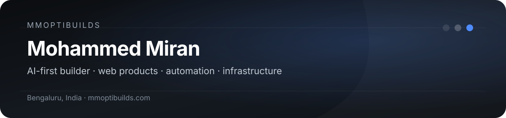

  

  <a href="https://mmoptibuilds.com"><strong>mmoptibuilds.com</strong></a>
  &nbsp;·&nbsp;
  <a href="https://x.com/mmoptibuilds">X / @mmoptibuilds</a>

## About

I'm **Mohammed Miran**, a BCA student and the builder behind **mmoptibuilds** in Bengaluru, India.

I work **AI-first**: I shape the product, UX, architecture, specifications, agent workflows, verification, and deployment, then use modern coding agents and tooling to turn that direction into working software. My interests sit at the intersection of **web products, local-first software, automation, infrastructure, and practical AI engineering**.

I care more about shipping something coherent, fast, accessible, and maintainable than collecting technologies for their own sake.

## Selected work

| Project | What it is | Highlights |
| --- | --- | --- |
| **[Hearth OS](https://github.com/mmoptibuilds-commits/web-dash)** | A local-first, installable personal desktop for the browser. | Floating windows, responsive iOS-style mobile sheets, Dexie persistence, PWA/offline support, selective Liquid Glass, automated QA. |
| **[mmoptibuilds](https://github.com/mmoptibuilds-commits/mmoptibuilds-portfolio-yin-yang)** | One business platform with two distinct divisions: Systems and Studio. | Two design systems, owner console, enquiry storage, SEO/accessibility foundations, responsive QA, nine-gate verification. |
| **[Coldharbour](https://github.com/mmoptibuilds-commits/coldharbour)** | A full-stack demonstration product for clinical cold-chain monitoring. | Next.js, React, TypeScript, PostgreSQL, Drizzle, telemetry exploration, GSAP/Lenis motion, accessibility and SEO. |
| **[Client Upload Portal](https://github.com/mmoptibuilds-commits/mmoptibuilds-upload-portal)** | A protected client-to-admin upload workflow for mmoptibuilds. | Authenticated user/admin flows, resumable-upload architecture, history and operational tooling. |
| **[Portfolio Setup](https://github.com/mmoptibuilds-commits/portfolio-setup)** | A structured guide for running an AI-assisted product/design/QA workflow. | Planning, implementation, visual QA, verification, handoffs, one-writer-at-a-time repo safety. |

## What I work with

**Product & web**  
Next.js · React · TypeScript · Tailwind CSS · PostgreSQL · Drizzle ORM · Supabase · Dexie / IndexedDB · PWA architecture

**Quality & delivery**  
Playwright · Vitest · Axe accessibility checks · responsive testing · performance budgets · Vercel · Cloudflare

**Systems & infrastructure**  
Linux / Ubuntu · Docker · Portainer · SSH · DNS · Cloudflare Tunnel · Tailscale · self-hosted services

**AI engineering workflow**  
Claude Code · Codex · Gemini / Antigravity · OpenCode · MCP · Ollama · multi-model planning, implementation, review and verification workflows

## How I build

- **Product first.** Define the job, constraints, user journey and quality bar before adding complexity.
- **AI-assisted, human-directed.** Agents help implement; I direct the product, trade-offs, review loop and final acceptance.
- **Verification matters.** Type checks, linting, tests, accessibility, responsive QA and real browser checks are part of the build, not an afterthought.
- **Low-maintenance wins.** Prefer simple, proven architecture over fragile complexity when the outcome is the same.
- **No fake claims.** Demo data, experiments and production work should be clearly distinguished.

## Current focus

- Refining **Hearth OS** into a polished browser desktop that feels native rather than website-like.
- Building **mmoptibuilds Studio + Systems** as a focused business platform.
- Improving repeatable **AI-agent engineering workflows** for planning, implementation, QA and deployment.

---

  <strong>Building useful things at the boundary of design, software, AI and infrastructure.</strong>

