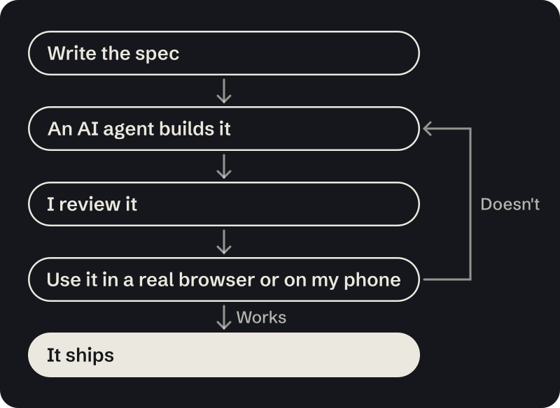

I build local-first apps and web products in Bengaluru. My work lives at [mmoptibuilds.com](https://mmoptibuilds.com). I'm @mmoptibuilds on [X](https://x.com/mmoptibuilds), [Instagram](https://www.instagram.com/mmoptibuilds) and [Threads](https://www.threads.net/@mmoptibuilds). If you need a website or hardware for a small business, email me at [hello@mmoptibuilds.com](mailto:hello@mmoptibuilds.com).

## About

The name at the top cycles through five languages. <ruby>हिन्दी<rt>Hindi</rt></ruby> and <ruby>اردو<rt>Urdu</rt></ruby> are my first, I speak English and <ruby>ಕನ್ನಡ<rt>Kannada</rt></ruby>, and I'm learning <ruby>日本語<rt>Japanese</rt></ruby>.

I'm a BCA student and I run mmoptibuilds. It has two sides: Studio builds websites and web apps, and Systems handles custom PCs, workstations and hardware for small businesses.

On software projects I write the spec and decide how things should look and behave. Nothing counts as done until I've used it in a real browser or on my own phone.

## Work

Offline-first notes for Android and Linux. Notes are encrypted on the device and sync directly between your own devices over Wi-Fi, with no account or server.

A browser extension that opens Markdown from the web or your disk and renders it properly, maths and Mermaid diagrams included. Runs in Chrome, Edge, Vivaldi and Firefox.

A product site for a made-up company that monitors temperatures on clinical shipments. The company and its data are fictional. The site runs on Next.js and PostgreSQL. [Live demo](https://coldharbour.mmoptibuilds.com).

The business site for Studio and Systems, with an owner console for handling enquiries. [Visit the site](https://mmoptibuilds.com).

How clients send me files. I create the accounts, uploads pick up where they left off if the connection drops, and files end up in Google Drive.

A desktop that runs in the browser, with windows, widgets and offline storage. You can install it like an app.

[Portfolio Setup](https://github.com/mmoptibuilds-commits/portfolio-setup) is the written-down version of how I run projects with AI agents.

## Tools

By area

| Area | What I use |
| --- | --- |
| Web | Next.js, React, TypeScript, Tailwind CSS, Vite |
| Apps | Flutter and Dart, browser extensions with WXT |
| Data | PostgreSQL, Drizzle, Supabase, SQLite, Dexie |
| Testing | Playwright, Vitest, axe |
| Hosting | Vercel, Cloudflare, Docker, Tailscale, my own Linux machines at home |
| AI | Claude Code, Codex, Gemini, OpenCode, Ollama, MCP |

## How I work

- I start from what the person using it needs to get done, and only add complexity when that needs it.
- I use AI coding agents heavily. I write the spec, review what they produce, and decide what ships.
- I test on real browsers and devices. Notes was checked on my phone and laptop before release.
- When something simple works as well as something clever, I pick the simple one.

## Right now

- Working on Notes. The next step is testing the in-app updater against a real published release.
- Building a new business website for mmoptibuilds.

## Contact

